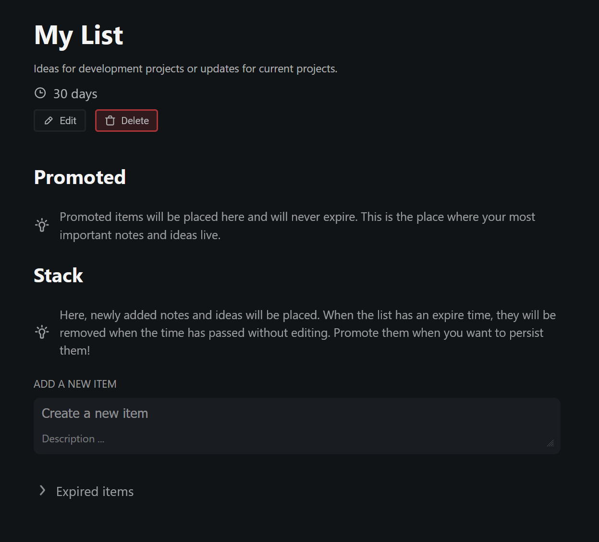

*A simple web application to better manage your great as well as your dumb ideas.*

## Concept

The basic concept of *Pronote* is actually somewhat stolen from the Tab concept of the [Arc browser](https://arc.net).

New items are added to the *"Stack"*. There, they live until you feel the need to actively *"promote"* them into the upper *"Promoted"* section. If the list has an expiration period, items in the Stack will automatically be moved to *"Expired items"* after the time has passed. The expiry is reset when you edit an entry. In the *"Promoted"* section, items never expire. Here live your most important ideas and notes.

### Inspiration

The inspiration to build this web app actually came from a problem I got with the way I was managing ideas in lists, which just piled up ideas over ideas until the point where I was so overwhelmed when opening thoses lists, that I basically lost all motivation to work on them. With this new way of filtering the great ideas from the "stupid" ones you have one day but don't really want to folow up on, I want to better focus on the ideas I actually want to do.

## Hosting

*TODO™️*